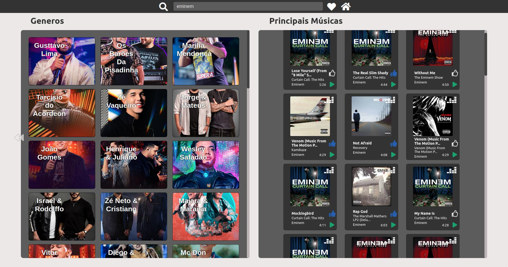
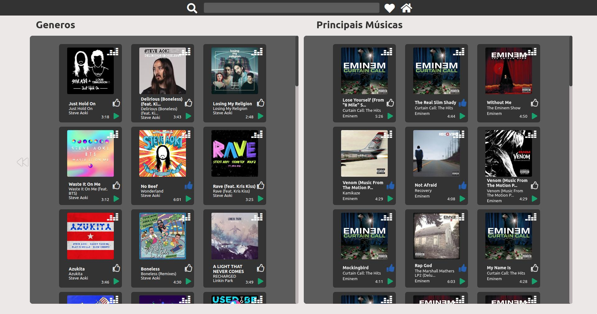
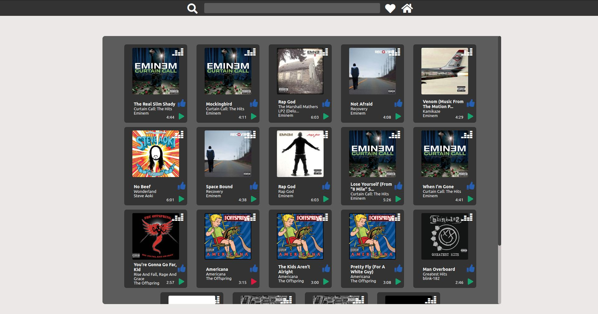

# Musics Library

Uma aplicação para ouvir e escolher suas músicas preferidas, pode ouvir uma prévia delas, ou ser redirecionado para o site da deezer e ouvir completa, pode filtrar por gênero, artista, e album.

## Indice
* [Deploy](#deploy)
* [Tecnologias](#tecnologias)
* [Instalação](#instalação)
* [Funcionalidades](#funcionalidades)
  * [Tela Principal](#telaprincipal---musics)
  * [Tela de Favoritos](#teladefavoritos---musics---favorites)

## Screenshots








## Deploy
<a href=https://rods27.github.io/musics-library/ target="blank">Link para o teste da aplicação</a>
Ou cole https://rods27.github.io/musics-library/ no navegador.

## Tecnologias
<ul>
  <li>Javascript</li>
  <li><a href="https://reactjs.org">React</a></li>
  <li>Redux</li>
  <li><a href="https://styled-components.com/">Styles Components</a></li>
</ul>

## Instalação
Assim que tiver clonado o repositório, usando o terminal do [vscode](https://code.visualstudio.com/) ou o terminal do seu sistema operacional.
- Installe as dependencias usando :
```
npm install
```
Faça o comando tanto na pasta raiz.

## Funcionalidades
[Voltar ao Indice](#indice)
#### Tela Principal ```/musics``` 
  <ul>
    Filtro de Gênero musical:
    <li>O usuario pode escolher um gênero, e irá filtrar os artistas pelo gênero.</li>
    <ul>
      <li>Assim que filtrar o usuário pode escolher um artista e filtrar as músicas mais ouvidas dele.</li>
      <li>O usuário pode ouvir a prévia de 30s da música e pode adicioná-la as favoritos.</li>
      <li>Caso o usuário prefira, ao clicar no botão será redirecionado ao site da deezer pra ouvir a versão completa.</li>
    </ul>
    Principais Músicas:
    <li>Nesta parte da tela, serão mostradas as principais músicas do momento pela Deezer.</li>
    <li>O usuário pode ouvir a prévia de 30s da música e pode adicioná-la as favoritos.</li>
    <li>Caso o usuário prefira, ao clicar no botão será redirecionado ao site da deezer pra ouvir a versão completa.</li>
    Header:
    <ul>
      <li>O usuário pode digitar alguma palavra e filtrar por músicas na tela de músicas principais.</li>
      Botão da Lupa:
      <li>Pesquisará pela palavra digitada no campo de pesquisa.</li>
      Botão de Coração:
      <li>Será redirecionado aos favoritos.</li>
      Botão de Casa:
      <li>Será redirecionado a Tela Principal.</li>
    </ul>
  </ul><br>
  
 #### Tela de Favoritos  ```/favoritos```
  <ul>
    <li>Nesta parte da tela, serão mostradas as músicas favoritas do usuário.</li>
    <li>O usuário pode ouvir a prévia de 30s da música e pode e removê-las dos favoritos.</li>
    <li>Caso o usuário prefira, ao clicar no botão será redirecionado ao site da deezer pra ouvir a versão completa.</li>
  </ul><br>
  
 [Voltar ao Indice](#indice)
## Feedback 

Ficarei bem agradecido caso queira me dar um feedback costrutivo, caso queira meus contatos estarão abaixo!

Email: rods.leite27@gmail.com e <a href="https://linkedin.com/in/rodrigoleite27">Linkedin</a>.
