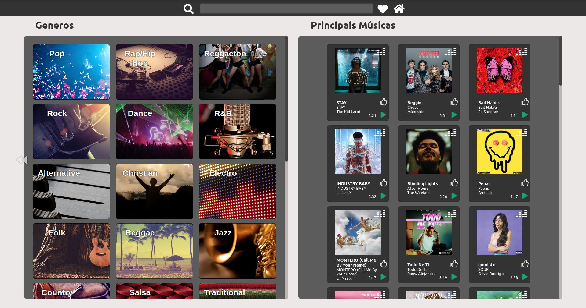
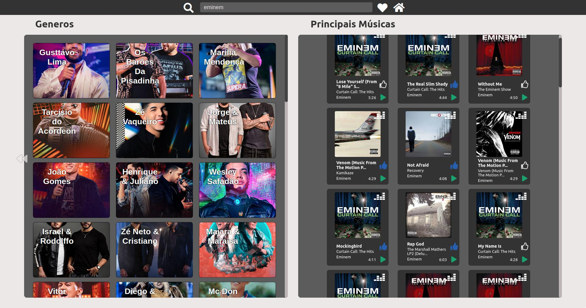
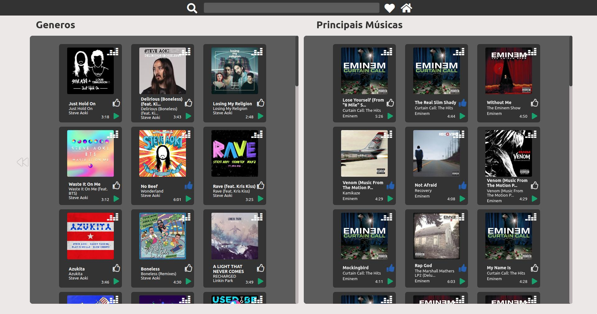
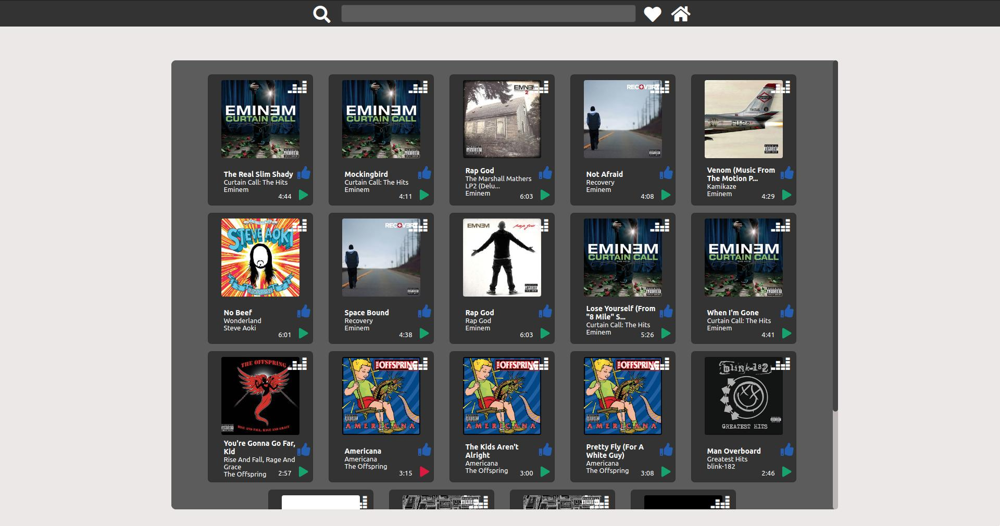

# Musics Library

An application to play and choose your favorite musics, you can listen a preview or be redirected to deezer's website and listen the complete version. You can filter by genre, artist and album too.

## Indice
* [Technologies](#Technologies)
* [Installation](#installation)
* [Initializing](#initializing)
* [Functionalities](#functionalities)
  * [Main Screen](#mainscreen---musics)
  * [Favorites](#favorites---musics---favorites)

## Screenshots









## Technologies
<ul>
  <li>Javascript</li>
  <li><a href="https://reactjs.org">React</a></li>
  <li>Redux</li>
  <li><a href="https://styled-components.com/">Styled Components</a></li>
</ul>

## Installation
Once you've cloned the repository using the [vscode](https://code.visualstudio.com/) terminal or on your sistem terminal.
- Install the depencencies using:
```
npm install
```
Do the command in both ```client``` and ```server``` folders.

## Initializing
This application do requests to deezer's API, as the application uses the localhost, the deezer api blocks requests from another domains, like localhost.
So, you need to go in ```server``` folder, open the terminal and paste ```npm start``` in terminal.
Do the same command on ```client``` folder, ```npm start```.


## Functionalities
#### Main Screen ```/musics``` 
  <ul>
    <li>Filter by genre:
      <ul>
        <li>The user can filter by genre and display all artists associated with the selected genre.</li>
        <li>After applying the filter, the user can select an artist and further filter their most listened-to songs.</li>
        <li>The user can preview a 30-second snippet of the song and add it to their favorites.</li>
        <li>If the user prefers, clicking the button will redirect them to the Deezer website to listen to the complete version.</li>
      </ul>
    </li>
    <li>Main Songs:
      <ul>
        <li>In this section of the screen, the current top songs on Deezer will be displayed.</li>
        <li>The user can preview a 30-second snippet of the song and add it to their favorites.</li>
        <li>If the user prefers, clicking the button will redirect them to the Deezer website to listen to the complete version.</li>
      </ul>
    </li>
    <li>Header:
      <ul>
        <li>The user can enter a keyword to search for songs on the main songs screen.</li>
        <li>Search Button:
          <ul>
            <li>Will search for the entered keyword in the search field.</li>
          </ul>
        </li>
        <li>Heart Button(Favorites):
          <ul>
            <li>Will redirect to the favorites.</li>
          </ul>
        </li>
        <li>Home Button:
          <ul>
            <li>Will redirect to the Main Screen.</li>
          </ul>
        </li>
      </ul>
    </li>
  </ul><br>
  
 #### Favorites  ```/musics/favorites```
  <ul>
    <li>In this section of the screen, the user's favorite songs will be displayed.</li>
    <li>The user can preview a 30-second snippet of the song, and they can also remove them from favorites.</li>
    <li>If the user prefers, clicking the button will redirect them to the Deezer website to listen to the complete version.</li>
  </ul><br>
  
## Feedback 

I would greatly appreciate it if you could provide me with constructive feedback. If you'd like to get in touch, my contactin formation is provided below!

Email: rods.leite27@gmail.com or <a href="https://linkedin.com/in/rodrigoleite27">Linkedin</a>.
